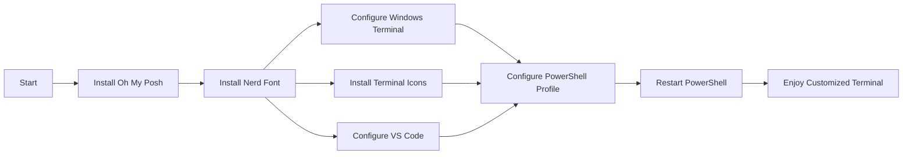

# Comprehensive Guide to Customizing Windows Terminal and VS Code with Oh My Posh

## Table of Contents
1. [Prerequisites](#prerequisites)
2. [Installation and Setup Process](#installation-and-setup-process)
3. [Detailed Steps](#detailed-steps)
   1. [Install Oh My Posh](#step-1-install-oh-my-posh)
   2. [Install a Nerd Font](#step-2-install-a-nerd-font)
   3. [Configure Windows Terminal](#step-3-configure-windows-terminal)
   4. [Install Terminal Icons](#step-4-install-terminal-icons-optional)
   5. [Configure PowerShell Profile](#step-5-configure-powershell-profile)
   6. [Configure VS Code](#step-6-configure-vs-code)
   7. [Restart PowerShell and VS Code](#step-7-restart-powershell-and-vs-code)
4. [Additional Tips](#additional-tips)
   1. [Exploring themes](#1-exploring-themes)
   2. [Customizing themes](#2-customizing-themes)
   3. [Troubleshooting](#3-troubleshooting)
   4. [Additional customization](#4-additional-customization)
5. [Setting up Git Aliases](#setting-up-git-aliases)

## Prerequisites

- Windows 10 or 11
- Windows Terminal (install from Microsoft Store if not already installed)
- PowerShell 5.1 or PowerShell Core 6+ (preferably PowerShell 7+)
- Visual Studio Code
- Administrator privileges

## Installation and Setup Process



## Detailed Steps

### Step 1: Install Oh My Posh

#### Option A: Using winget (recommended)

1. Open PowerShell as Administrator
2. Run the following command:
   ```powershell
   winget install JanDeDobbeleer.OhMyPosh -s winget
   ```

#### Option B: Using Chocolatey

1. If Chocolatey is not installed, install it first:
   ```powershell
   Set-ExecutionPolicy Bypass -Scope Process -Force; [System.Net.ServicePointManager]::SecurityProtocol = [System.Net.ServicePointManager]::SecurityProtocol -bor 3072; iex ((New-Object System.Net.WebClient).DownloadString('https://community.chocolatey.org/install.ps1'))
   ```
2. Install Oh My Posh:
   ```powershell
   choco install oh-my-posh
   ```

### Step 2: Install a Nerd Font

1. Visit https://www.nerdfonts.com/font-downloads
2. Choose a font (e.g., "CascadiaCode" or "SourceCodePro")
3. Click the download button
4. Once downloaded, locate the zip file in your Downloads folder
5. Right-click the zip file and select "Extract All..."
6. Choose a destination folder and click "Extract"
7. Open the extracted folder
8. Select all font files (usually .ttf or .otf files)
9. Right-click and choose "Install" or "Install for all users"
10. Wait for the installation to complete

### Step 3: Configure Windows Terminal

1. Open Windows Terminal
2. Click the down arrow in the tab bar and select "Settings"
3. In the left sidebar, click on "Open JSON file"
4. In the `profiles` section, add or modify the `defaults` object:
   ```json
   "profiles": 
   {
       "defaults": 
       {
           "font": 
           {
               "face": "SauceCodePro NF",
               "size": 11
           }
       },
       "list": [
           // ... existing profiles ...
       ]
   }
   ```
   Replace "SauceCodePro NF" with the name of the Nerd Font you installed
5. Save the file and close it

### Step 4: Install Terminal Icons (optional)

1. Open PowerShell
2. Run the following command:
   ```powershell
   Install-Module -Name Terminal-Icons -Repository PSGallery -Force
   ```

### Step 5: Configure PowerShell Profile

1. Open PowerShell
2. Run the following command to create or open your profile:
   ```powershell
   if (!(Test-Path -Path $PROFILE)) { New-Item -ItemType File -Path $PROFILE -Force }
   notepad $PROFILE
   ```
3. Add the following lines to your profile:
   ```powershell
   oh-my-posh init pwsh --config 'C:\Users\ditah\AppData\Local\Programs\oh-my-posh\themes\clean-detailed.omp.json' | Invoke-Expression
   Import-Module -Name Terminal-Icons
   ```
4. Save the file and close it

### Step 6: Configure VS Code

1. Open Visual Studio Code
2. Press `Ctrl+,` to open Settings
3. In the search bar, type "font"
4. Find "Editor: Font Family" and add the Nerd Font to the beginning of the list. For example:
   ```
   'SauceCodePro NF', Consolas, 'Courier New', monospace
   ```
5. To enable font ligatures (optional), find "Editor: Font Ligatures" and set it to `true`
6. To configure the integrated terminal, search for "terminal font" and update "Terminal > Integrated > Font Family" with the same font:
   ```
   SauceCodePro NF
   ```
7. If you want to use Oh My Posh in the VS Code integrated terminal, you can add the following to your `settings.json`:
   ```json
   "terminal.integrated.profiles.windows": {
     "PowerShell": {
       "source": "PowerShell",
       "icon": "terminal-powershell",
       "args": ["-NoExit", "-Command", "oh-my-posh init pwsh --config 'C:/Users/ditah/AppData/Local/Programs/oh-my-posh/themes/clean-detailed.omp.json' | Invoke-Expression"]
     }
   },
   "terminal.integrated.defaultProfile.windows": "PowerShell"
   ```

### Step 7: Restart PowerShell and VS Code

Close and reopen PowerShell and VS Code for the changes to take effect. Alternatively, in PowerShell, you can run:
```powershell
. $PROFILE
```

## Additional Tips

### 1. Exploring themes:
   - Browse themes at https://ohmyposh.dev/docs/themes
   - To try a different theme, replace the config path in your profile with:
     ```powershell
     oh-my-posh init pwsh --config "$env:POSH_THEMES_PATH\<theme-name>.omp.json" | Invoke-Expression
     ```
     Replace `<theme-name>` with the desired theme name

### 2. Customizing themes:
   - Copy a theme JSON file from `$env:POSH_THEMES_PATH` to a personal location
   - Edit the JSON file to customize colors, segments, etc.
   - Update your profile to use the custom theme file

### 3. Troubleshooting:
   - If icons don't appear correctly, ensure you've installed a Nerd Font and configured Windows Terminal and VS Code to use it
   - If colors seem off, check your terminal color scheme in the Windows Terminal settings and VS Code settings

### 4. Additional customization:
   - Explore Oh My Posh documentation for advanced configuration options: https://ohmyposh.dev/docs/
   - Consider adding aliases or custom functions to your PowerShell profile for frequently used commands

## Setting up Git Aliases

To streamline your Git workflow, you can set up the following aliases:

1. Open PowerShell as Administrator
2. Run the following commands to set up essential Git aliases:
   ```powershell
   git config --global alias.st status
   git config --global alias.br branch
   git config --global alias.co commit
   git config --global alias.ch checkout
   ```
3. These essential aliases allow you to use shorter commands:
   - `git st` for `git status`
   - `git br` for `git branch`
   - `git co` for `git commit`
   - `git ch` for `git checkout`

4. Optionally, you can set up additional aliases for push and pull:
   ```powershell
   git config --global alias.pu pull
   git config --global alias.ph push
   git config --global core.pager cat                # Disables paging by sending all output directly to the terminal
   git config --global advice.statusHints true       # Enables hints in `git status` to provide helpful suggestions
   git config --global advice.commitBeforeMerge true # Provides a reminder to commit any changes before merging
   git config --global alias.br "branch -vv"         # Creates an alias `git br` that lists branches with verbose output
   git config --global color.ui auto                 # Enables automatic color-coding in Git output for easier readability
   ```
   These optional aliases provide:
   - `git pu` for `git pull`
   - `git ph` for `git push`

5. To view all your current Git aliases, run:
   ```powershell
   git config --get-regexp alias
   ```
6. To remove an alias you no longer want, use the `--unset` option. For example:
   ```powershell
   git config --global --unset alias.st
   ```

Note: These Git aliases work with the `git` command itself and are available in any shell or Git-enabled application, not just in PowerShell.

By following these steps and tips, you'll have a fully customized Windows Terminal and VS Code setup with Oh My Posh, complete with a stylish prompt, custom font, and efficient Git aliases. Remember to experiment with different themes, settings, and aliases to find the configuration that works best for your workflow!
